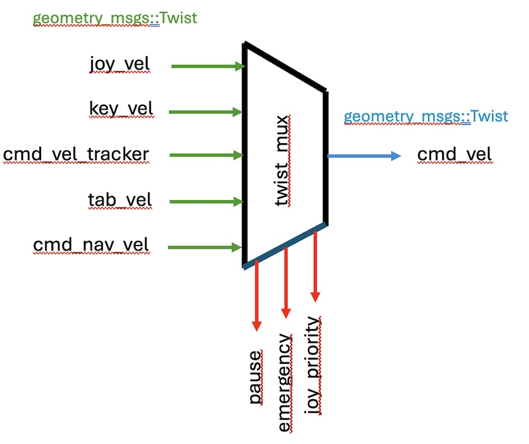

# Notes on Chapter 4 Roomba

## Twist messages /cmd_vel

1. With the ROS 2 Jazzy controller architecture, cmd_vel messages used in relevant Jazzy packages since 2024, are now **TwistStamped** type, vs **Twist**. The above referenced **slgrobotics** fork that informs code in several places, has been modified with revised launch and yaml parameter files to support it. Also added are remappings to /diff_cont/* to match Jazzy Controller architecture used in “sim” Gazebo Simulations. Your regular teleop Node might not work with your robot base configuration as with current Jazzy distribution the default “stamped” parameter is false. Refer to the  **ros-teleop/teleop_twist_keyboard** and **teleop_twist joy** for details of the stamped parameter and how to set “stamped:=true” on a CLI or as a parameter in a configuration yaml file. eg. to launch the “**teleop_twist_keyboard**”,

2. The current Jazzy release of this MockBot repository includes a ROS 2 package called **twist_mux** that provides a multiplexer for **geometry_msgs::Twist** messages. It subscribes to N input twist topics and publishes outputs the messages from a single /cmd_vel one. This /cmd_vel message would be subscribed by Robot Base packages.  For selecting the topic they are prioritized based on their priority, the messages timeout and M input lock topics that can inhibit one input twist topic. This is described in these documents, illustrated in the Fig. 1 below. 

https://wiki.ros.org/twist_mux and https://github.com/ros-teleop/twist_mux

Note that the subscribed topic names are unique and distinctive from the ubiquitous /cmd_vel topic. e.g. the navigation subscribe is **cmd_vel_nav**. Each of the packages that would normally Publish the /cmd_vel message must include a parameter remapping in its Node launch file, such as in  **nav2_bringup navigation.launch.py** ,  “remappings=remappings + [(‘cmd_vel’), (‘cmd_vel_nav’)] . Similarly, any joy, keyboard launch file must do likewise.  

In a system with a running twist_mux package, to manually test that a “launched” Robot Base is correctly responding to /cmd_vel messages, without  using the usual fully configured Desktop Teleop launch, do this:  

**$ ros2 run teleop_twist_keyboard teleop_twist_keyboard –ros-args -p stamped:=true -r /cmd_vel:=key_vel**

One further “remapping note”. The /cmd_vel topic described in the **slgroboitics/articubot_one** repository uses an additional remapping to topic name: **/diff_cont/cmd_vel** to match Jazzy Controller Architecture for use with a future use of Gazebo Simulations (gz_sim Harmonic), that are not installed in the MockBot design nor described in this book, where a ROS 2 “Controller Manager” and its infrastructure is used.
